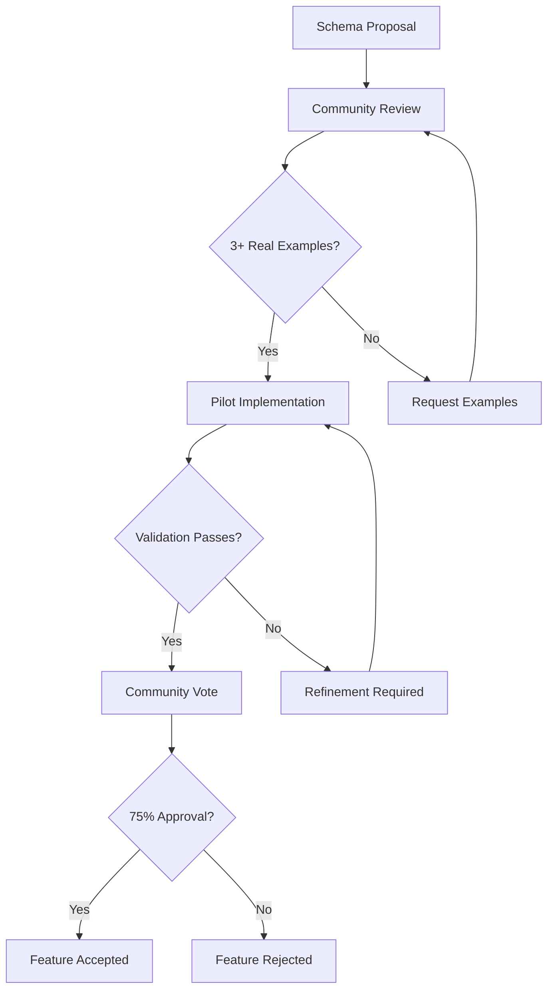

# Implementation Guide: Advanced Features & Best Practices

## 🚀 Schema System Overview

Our comprehensive digital service design schemas go far beyond basic persona templates. This implementation guide helps teams adopt and maximize the value of our 9-field system with integrated journey mapping.

### Architecture
```
Base Persona Schema (4 fields)
├── Comprehensive Core Attributes (9 fields)
│   ├── goals ← With priority + timeframe + success criteria
│   ├── pain_points ← With severity + frequency + business impact
│   ├── motivations ← With behavioral type classification
│   ├── experience_level ← Skill/expertise assessment
│   ├── channels ← NEW: 5 types + usage context + preferences
│   ├── moments_that_matter ← NEW: Critical emotional touchpoints
│   ├── barriers ← NEW: 9-type organizational friction taxonomy
│   ├── use_cases ← NEW: Common interaction scenarios
│   └── success_metrics ← NEW: Quantified performance indicators
├── Journey Integration Layer
│   ├── Persona-Journey Linking
│   ├── Barrier-to-Friction Mapping
│   ├── Multi-Channel Progression
│   └── Emotional Arc Integration
└── Advanced Validation & Analytics
    ├── Cross-validation systems
    ├── Quality level scoring
    ├── Business impact quantification
    └── Community contribution patterns
```

---

## 🎯 Implementation Phases

### Phase 1: Foundation Assessment (Week 1)

#### 1.1 Current State Analysis
Evaluate your existing persona maturity:

**Basic Persona Audit**
```bash
# Run assessment on existing personas
node tools/validators/assess-current-state.js /path/to/existing-personas/

# Sample Output:
📊 Current Persona Maturity Assessment
==========================================
Files analyzed: 8 personas
Average completion: 45% (Basic level)

Opportunities:
🔴 HIGH IMPACT: Add barriers analysis (8/8 missing)
🟡 MEDIUM IMPACT: Enhance pain points with severity (6/8 missing)
🟢 LOW IMPACT: Add channel preferences (4/8 missing)

Recommended Implementation Order:
1. Barriers taxonomy (highest ROI)
2. Enhanced pain points (quick wins)
3. Channel optimization (journey integration)
```

#### 1.2 Team Skill Assessment
```markdown
**Comprehensive Schema Readiness Checklist**

Research & Analysis Skills:
- [ ] Behavioral barrier identification
- [ ] Emotional journey mapping
- [ ] Multi-channel experience analysis
- [ ] Quantitative success metrics definition

Technical Implementation:
- [ ] JSON schema validation
- [ ] Cross-reference data management
- [ ] Version control for design artifacts
- [ ] Automated validation workflows

Design Integration:
- [ ] Persona-journey linking concepts
- [ ] Barrier-to-friction mapping
- [ ] Multi-touchpoint orchestration
- [ ] Evidence-based design decision making
```

### Phase 2: Core Implementation (Week 2-4)

#### 2.1 Barrier Taxonomy Implementation
Start with our 9-type barrier system - the highest-value addition:

```json
// Implementation Priority: Start with these 3 barrier types
{
  "barriers": [
    {
      "type": "process",
      "description": "Specific workflow or procedural friction",
      "severity": "high|medium|low", 
      "impact_areas": ["efficiency", "satisfaction", "outcomes"],
      "business_impact": "Quantified cost or lost opportunity"
    },
    {
      "type": "technology", 
      "description": "Technical limitations or integration challenges",
      "severity": "high|medium|low",
      "impact_areas": ["capability", "performance", "scalability"],
      "business_impact": "System performance or capability impact"
    },
    {
      "type": "resource",
      "description": "Time, budget, or skill constraints", 
      "severity": "high|medium|low",
      "impact_areas": ["decision_quality", "speed", "scope"],
      "business_impact": "Resource allocation inefficiency"
    }
  ]
}
```

**Barrier Implementation Workflow:**
1. **Interview Analysis**: Review existing user research for friction indicators
2. **Pattern Recognition**: Group similar friction points by barrier type
3. **Impact Quantification**: Add business value measurements where possible
4. **Severity Assessment**: Rate barriers by user impact (high/medium/low)
5. **Validation**: Confirm barrier accuracy with users or stakeholders

#### 2.2 Moments That Matter Implementation
Identify critical emotional touchpoints:

```json
// Implementation Template: Critical Moments
{
  "moments_that_matter": [
    {
      "moment": "Specific situational trigger",
      "emotional_state": -2, // Scale: -2 (very negative) to +2 (very positive)
      "importance": "critical|high|medium", 
      "context": "Why this moment matters deeply to the persona",
      "trigger": "What causes this moment to occur",
      "ideal_outcome": "Best-case resolution for the persona"
    }
  ]
}
```

**Moments Implementation Workflow:**
1. **Research Mining**: Extract high-emotion situations from user research
2. **Impact Assessment**: Identify moments with business/personal consequences
3. **Emotional Calibration**: Rate emotional intensity on -2 to +2 scale
4. **Context Development**: Explain why this moment creates strong emotion
5. **Journey Mapping**: Link moments to specific journey phases

#### 2.3 Comprehensive Channel System
Implement 10-channel taxonomy with rich context:

```json
// Channel Types with Business Context
{
  "channels": [
    {
      "name": "Specific channel name",
      "type": "in_person_events|self_service_digital|personal_interaction|mobile_app|social_recommendations",
      "usage_context": "When and why this channel is used",
      "preference_level": "high|medium|low",
      "frequency": "daily|weekly|monthly|occasional",
      "influence_stage": "awareness|consideration|decision"
    }
  ]
}
```

### Phase 3: Journey Integration (Week 5-6)

#### 3.1 Persona-Journey Linking Architecture
```json
// Journey Context Referencing
{
  "context": {
    "persona_id": "specific-persona-id",
    "persona_context": "Detailed situational context for this journey instance",
    "scenario": "Specific use case or trigger situation", 
    "emotional_baseline": -1, // Starting emotional state
    "success_definition": "Clear outcome criteria from persona perspective",
    "barrier_profile": ["primary", "secondary", "tertiary"] // Most relevant barriers
  }
}
```

#### 3.2 Barrier-to-Journey Friction Mapping
Map persona barriers to specific journey friction:

```json
// Journey Step with Barrier Manifestation
{
  "id": "journey-step-id",
  "name": "Journey step name",
  "lane_content": {
    "user_story": "User's goal at this step",
    "barriers_manifesting": [
      "barrier_type: specific barrier description from persona"
    ],
    "friction_points": [
      "Concrete friction caused by the barrier",
      "System limitation that creates difficulty",
      "Process complexity that slows progress"
    ],
    "emotion": -2, // Emotional impact of friction
    "moments_triggered": "Which persona 'moments that matter' are activated"
  }
}
```

### Phase 4: Advanced Analytics & Optimization (Week 7-8)

#### 4.1 Quality Level Scoring
Track implementation sophistication:

```javascript
// Quality Level Calculation
const calculateQualityLevel = (persona) => {
  const scores = {
    basic_fields: persona.identity && persona.core_attributes ? 20 : 0,
    enhanced_goals: persona.core_attributes?.goals?.[0]?.priority ? 10 : 0,
    pain_points_severity: persona.core_attributes?.pain_points?.[0]?.severity ? 10 : 0,
    barriers_present: persona.core_attributes?.barriers?.length > 0 ? 15 : 0,
    channels_rich: persona.core_attributes?.channels?.[0]?.usage_context ? 15 : 0,
    moments_defined: persona.core_attributes?.moments_that_matter?.length > 0 ? 15 : 0,
    research_backed: persona.validation?.research_sources?.length > 0 ? 10 : 0,
    journey_ready: persona.identity?.id && /^[a-z0-9_-]+$/.test(persona.identity.id) ? 5 : 0
  };
  
  const total = Object.values(scores).reduce((sum, score) => sum + score, 0);
  return {
    total_score: total,
    level: total >= 80 ? "COMPREHENSIVE" : total >= 60 ? "ENHANCED" : "BASIC",
    missing_fields: Object.entries(scores).filter(([key, score]) => score === 0)
  };
};
```

#### 4.2 Cross-Persona Pattern Analysis
```javascript
// Identify Common Barriers Across Personas
const analyzeBarrierPatterns = (personaSet) => {
  const barrierFrequency = {};
  const impactAreas = {};
  
  personaSet.forEach(persona => {
    persona.core_attributes?.barriers?.forEach(barrier => {
      barrierFrequency[barrier.type] = (barrierFrequency[barrier.type] || 0) + 1;
      barrier.impact_areas?.forEach(area => {
        impactAreas[area] = (impactAreas[area] || 0) + 1;
      });
    });
  });
  
  return {
    most_common_barriers: Object.entries(barrierFrequency)
      .sort(([,a], [,b]) => b - a)
      .slice(0, 5),
    primary_impact_areas: Object.entries(impactAreas)
      .sort(([,a], [,b]) => b - a)
      .slice(0, 3),
    organizational_insights: generateInsights(barrierFrequency, impactAreas)
  };
};
```

---

## 🔧 Validation Framework

### Advanced Validation Pipeline

#### Level 1: Technical Validation
```bash
# Comprehensive structural validation
node tools/validators/validate-persona.js persona.json --mode=comprehensive

# Validates:
✅ All 9 core attributes present and properly structured
✅ Barrier taxonomy compliance (9 valid types)
✅ Channel classification accuracy (5 valid types) 
✅ Emotional state range validation (-2 to +2)
✅ Cross-reference integrity (persona IDs, journey links)
✅ Business impact quantification presence
```

#### Level 2: Content Quality Validation
```bash
# Content depth and research backing assessment
node tools/validators/assess-quality.js persona.json --standards=comprehensive

# Analyzes:
📊 Research source diversity and recency
📊 Pain point specificity and business impact
📊 Goal achievability and measurement criteria
📊 Barrier severity alignment with persona context
📊 Channel preference consistency with persona type
📊 Moments that matter emotional authenticity
```

#### Level 3: Journey Integration Validation
```bash
# Cross-validation between personas and journeys
node tools/validators/validate-integration.js --personas=./personas/ --journeys=./journeys/

# Validates:
🔗 Persona ID references in journey contexts
🔗 Barrier manifestation accuracy in journey steps
🔗 Channel progression alignment with persona preferences
🔗 Emotional arc consistency with moments that matter
🔗 Success criteria alignment between personas and journey outcomes
```

### Quality Scoring Matrix

| **Quality Dimension** | **Basic (40-60%)** | **Professional (60-80%)** | **Comprehensive (80-100%)** |
|---------------------------|---------------------|------------------------|------------------------------|
| **Barrier Analysis** | 1-2 types, basic descriptions | 3-5 types, impact areas identified | 6+ barriers, business impact quantified |
| **Channel Orchestration** | Basic preferences listed | Usage context provided | Influence stage mapping + frequency |
| **Emotional Intelligence** | Basic satisfaction ratings | Some emotional context | Moments that matter + triggers |
| **Research Foundation** | Single source referenced | Multiple sources, some dates | Diverse sources, confidence levels, methodology |
| **Journey Integration** | Persona mentioned in journey | Persona context provided | Barriers mapped to friction, channels to touchpoints |

---

## 🤝 Community & Collaboration Framework

### Contribution Guidelines

#### Comprehensive Schema Contributions
```markdown
**Contributing New Features**

Schema Development:
1. **Propose new core attributes**
   - Business value justification
   - Implementation complexity assessment
   - Backward compatibility analysis
   - Community validation through 3+ real-world examples

2. **Expand barrier taxonomy**
   - New barrier type with clear definition
   - Distinct from existing 9 types
   - Applicable across persona types (business/consumer/employee)
   - Examples from 3+ different domains

3. **Add validation rules**
   - JSON schema syntax compliance
   - Clear error messages for violations
   - Performance impact assessment
   - Test coverage for new validation logic
```

#### Community Validation Process


### Industry Adoption Patterns

#### Healthcare Technology (David's Domain)
- **Compliance-first** validation with extended evidence requirements
- **Risk mitigation** focus requiring quantified business impact
- **Multi-stakeholder** approval processes reflected in journey complexity
- **Evidence-based** decision making with research source diversity

#### Consumer Services (Sarah's Domain)
- **Time-sensitive** decision making with mobile-first channel preferences
- **Social validation** heavy with community recommendation channels
- **Family-centered** outcome metrics with multi-stakeholder success criteria
- **Convenience-prioritized** with low-friction journey requirements

#### Enterprise B2B (Maria's Domain)
- **Performance-driven** with quantified revenue impact requirements
- **Relationship-based** channel orchestration with personal touch preferences
- **Process-efficiency** barrier focus with time-to-value optimization
- **Results-oriented** success metrics tied to business outcomes

---

## 📊 Advanced Analytics & Insights

### Implementation ROI Measurement

#### Immediate Value Indicators (Week 1-4)
```javascript
const measureImmediateValue = (before, after) => {
  return {
    persona_creation_speed: {
      before_hours: before.avg_creation_time,
      after_hours: after.avg_creation_time,
      improvement_pct: ((before.avg_creation_time - after.avg_creation_time) / before.avg_creation_time) * 100
    },
    data_quality_score: {
      validation_pass_rate: after.validation_pass_rate / before.validation_pass_rate,
      completeness_score: after.field_completeness / before.field_completeness
    },
    journey_integration_readiness: {
      personas_with_valid_ids: after.valid_id_count / after.total_personas,
      barrier_journey_mappable: after.barrier_analysis_complete / after.total_personas
    }
  };
};
```

#### Medium-term Impact (Month 1-6)
- **Design Decision Quality**: Measurable improvement in solution-persona fit
- **Cross-team Alignment**: Reduced persona interpretation variance
- **Research ROI**: Enhanced personas drive more targeted research investment
- **Tool Integration**: Automated analysis and visualization capabilities

#### Long-term Transformation (6+ Months)
- **Organizational Maturity**: Evidence-based design practice adoption
- **Predictive Capabilities**: Behavioral pattern recognition and forecasting
- **Industry Leadership**: Community contribution and thought leadership
- **Business Outcomes**: Measurable improvement in user satisfaction and business metrics

### Advanced Pattern Recognition

#### Barrier Clustering Analysis
```python
# Python example for advanced barrier analysis
import json
from collections import defaultdict
from sklearn.cluster import KMeans

def analyze_organizational_barriers(persona_dataset):
    """
    Identify common barrier patterns across persona types
    """
    barrier_patterns = defaultdict(list)
    
    for persona in persona_dataset:
        barriers = persona.get('core_attributes', {}).get('barriers', [])
        for barrier in barriers:
            barrier_patterns[barrier['type']].append({
                'severity': barrier.get('severity', 'unknown'),
                'impact_areas': barrier.get('impact_areas', []),
                'persona_type': persona['schema_info']['persona_type']
            })
    
    # Identify systematic organizational issues
    critical_barriers = {
        barrier_type: barriers 
        for barrier_type, barriers in barrier_patterns.items() 
        if sum(1 for b in barriers if b['severity'] == 'high') >= 2
    }
    
    return {
        'critical_patterns': critical_barriers,
        'recommendations': generate_organizational_recommendations(critical_barriers)
    }
```

---

## 🎯 Best Practices & Patterns

### Comprehensive Persona Creation Workflow

#### Research-to-Schema Pipeline
1. **Research Synthesis** → Extract behavioral patterns and friction points
2. **Barrier Classification** → Map friction to 9-type barrier taxonomy
3. **Channel Analysis** → Identify multi-touchpoint preferences and usage context
4. **Emotional Mapping** → Define critical moments with triggers and outcomes
5. **Success Definition** → Quantify goals and business value outcomes
6. **Journey Planning** → Design persona-journey integration architecture

#### Quality Assurance Checklist
```markdown
**Comprehensive Persona QA Standards**

Content Quality:
- [ ] All barriers have business impact quantification
- [ ] Channels include usage context and preference levels
- [ ] Moments that matter have emotional state and importance ratings
- [ ] Goals include success criteria and measurement methods
- [ ] Pain points specify severity, frequency, and context

Technical Quality:
- [ ] Persona ID follows naming conventions (lowercase, descriptive)
- [ ] All enumerated fields use valid values from schema
- [ ] Cross-references (to journeys, other personas) are accurate
- [ ] JSON structure validates against enhanced schemas
- [ ] Research sources include dates and confidence levels

Integration Quality:
- [ ] Barriers map clearly to journey friction points
- [ ] Channels align with journey touchpoint progression
- [ ] Emotional baseline connects to moments that matter
- [ ] Success criteria enable journey outcome measurement
```

### Advanced Implementation Patterns

#### Pattern 1: Progressive Development
Start with core fields, add depth iteratively:
```
Week 1: Basic structure + goals/pain points
Week 2: Add barriers (3 types) + channels (2-3 primary)
Week 3: Integrate moments that matter + success metrics
Week 4: Journey integration + cross-validation
```

#### Pattern 2: Research-Driven Development
Use existing research to populate fields:
```
Interview Data → Barriers + Moments that matter
Analytics Data → Channel preferences + success metrics
Survey Data → Pain point severity + goal priorities
Observational Data → Use cases + friction points
```

#### Pattern 3: Cross-Functional Collaboration
Engage diverse expertise for comprehensive personas:
```
UX Researchers → Behavioral patterns + emotional insights
Data Analysts → Channel usage + success metrics
Product Managers → Business context + success criteria
Customer Support → Pain points + friction analysis
Sales Teams → Decision processes + barrier identification
```

---

## 🚀 Future Roadmap & Evolution

### Version 2.0 Features (6-Month Horizon)
- **AI-Assisted Development**: Automated barrier detection from research data
- **Dynamic Persona Updates**: Real-time persona refinement from analytics
- **Cross-Industry Benchmarking**: Comparative barrier analysis across sectors
- **Advanced Journey Integration**: Multi-persona journey orchestration

### Community Ecosystem Development
- **Schema Registry**: Central repository for validated features
- **Tool Ecosystem**: Native integrations with popular design platforms
- **Certification Program**: Schema practitioner certification
- **Industry Working Groups**: Sector-specific development

### Measurement & Analytics Evolution
- **Predictive Modeling**: Behavioral pattern forecasting capabilities
- **ROI Attribution**: Design decision impact measurement
- **Continuous Learning**: Automated schema improvement recommendations
- **Community Intelligence**: Aggregate insights from adoption patterns

---

**The comprehensive digital service design schemas represent a fundamental advancement in systematic, evidence-based design practice. This implementation guide provides the foundation for transforming your organization's approach to user understanding and experience design.**

**Start your implementation today. The community is ready to support your journey toward comprehensive, integrated, and impactful persona-driven design.**